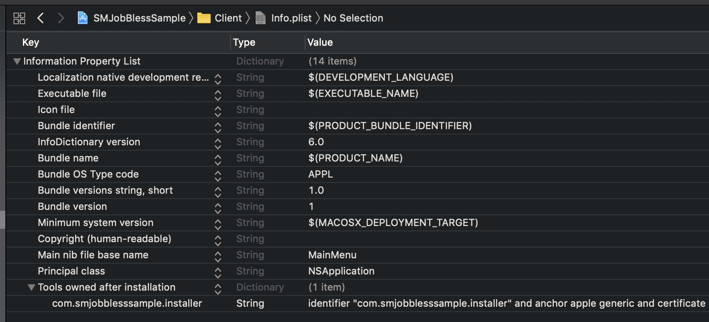
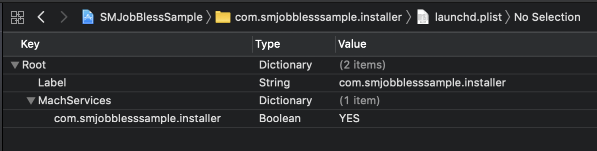
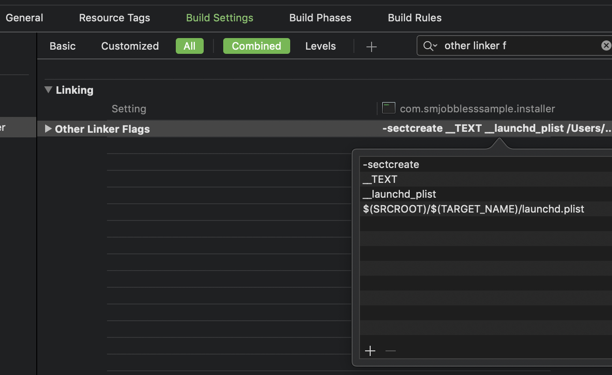
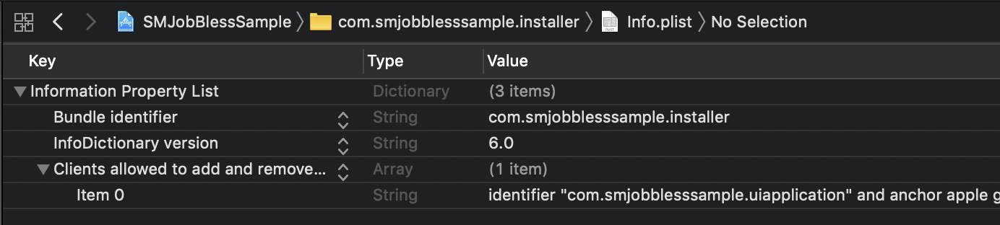

#  How to create project with SMJobBless()

In this example a simple UI application (`Client` target) launches a Helper Tool (root process, see `com.smjobblesssample.installer` target) in order to perform installation of some other application. Installation usually requires root privileges, so we take this use case as an example.

Also this sample shows how to establish an XPC connection between UI application and the Helper Tool.


## Used Definitions


Term                                  	| Definition
-----------                       	| -------------
Client                                    	| UI application, that requires some installation services
Server                                   | Helper tool (provides some installation services)
`launchd`                             | A system daemon, that manages loading all other processes
`launchd job label`        | A unique string, that describes the service, that is provided by the Helper Tool. In order to start the Helper tool, we need to register its label with `launchd`. A convention is to use reverse DNS notation, like `com.myApp.myService` or `com.myCompany.myApp.myService`. For example: `com.superDruperReader.installation`.


## Steps

### 1. Create targets

* Create а Client target; should be a bundle. `Cocoa Application` target type works great for this purpose.

* Create а Server target (`Command-Line Tool`). The product name for this target should be the same as the launchd job label.

### 2. Add Helper Tool to Client's bundle

* Client's Build Phases → Target Dependencies → add Server target to dependencies list

* Client's Build Phases → Add `Copy Files` phase. 
Destination: select 'Wrapper'
Subpath: paste ```Contents/Library/LaunchServices```
Add the Server application to this Copy Files phase.

### 3. Setup signing requirements    

* Check that you sign both applications.

#### 3.1 Client



* To client's `Info.plist` add ```SMPrivilegedExecutables``` key with type `Dictionary`
Add there a key-value pair:

**Key:** launchd job label  
**Value:** signing requirements

**Example:**

Key             | Value
------------- | -------------
```identifier "com.smjobblesssample.installer" and anchor apple generic and certificate leaf[subject.CN] = "Mac Developer: mail@example.com (ABCDEFGHIJ)" and certificate 1[field.1.2.840.113635.100.6.2.1] /* exists */```

#### 3.2 Server

* Create an `Info.plist` and `launchd.plist` files (you can name them whatever) for the Server.

##### 3.2.1 Launchd.plist


* Add `Label` key with launchd job label value.
* Add `MachServices` key with `Dictionary` type. Add there a key-value pair with launchd job label as key and `YES` Boolean as a value.
* Now we need to embed this file into the Helper binary file. Go to `Build Settings` and find `Other Linker Flags` (`OTHER_LDFLAGS`). Add 4 rows in given order:

```
-sectcreate
__TEXT
__launchd_plist
$(SRCROOT)/${TARGET_NAME}/launchd.plist
```



##### 3.2.2 Info.plist



* Add `CFBundleIdentifier` and paste there its bundle identifier.

* Add `CFBundleInfoDictionaryVersion` with string value `6.0`.

* Add ```SMAuthorizedClients``` key with Array of Strings type to Info.plist
Every entry in this array is a description for signing requirements for each client.

Example:

```
identifier "com.smjobblesssample.uiapplication" and anchor apple generic and certificate leaf[subject.CN] = "Mac Developer: mail@example.com (ABCDEFGHIJ)" and certificate 1[field.1.2.840.113635.100.6.2.1] /* exists */
```

* Open Server's `Build Settings` and find a setting called `Info.plist File` (`INFOPLIST_FILE`). Set the path to the Server's Info.plist. For example: `$(SRCROOT)/$(TARGET_NAME)/Info.plist`

* Now when the Server target knows where it's Info.plist is located, let's build it into the resulting binary file. Find another Build Setting: `Create Info.plist Section in Binary` (`CREATE_INFOPLIST_SECTION_IN_BINARY`) and set it to `YES`.

## Troubleshooting

### Error codes
If SMJobBless() fails, look for error code explanation in `SMErrors.h` header of the ServiceManagement framework. At the time this instruction is created it contains such errors:

```
* @const kSMErrorInternalFailure
* An internal failure has occurred.
*
* @const kSMErrorInvalidSignature
* The Application's code signature does not meet the requirements to perform
* the operation.
*
* @const kSMErrorAuthorizationFailure
* The request required authorization (i.e. adding a job to the
* {@link kSMDomainSystemLaunchd} domain) but the AuthorizationRef did not
* contain the required right.
*
* @const kSMErrorToolNotValid 
* The specified path does not exist or the tool at the specified path is not
* valid.
*
* @const kSMErrorJobNotFound 
* A job with the given label could not be found.
*
* @const kSMErrorServiceUnavailable 
* The service required to perform this operation is unavailable or is no longer
* accepting requests.
*/
enum {
kSMErrorInternalFailure = 2,
kSMErrorInvalidSignature,
kSMErrorAuthorizationFailure,
kSMErrorToolNotValid,
kSMErrorJobNotFound,
kSMErrorServiceUnavailable,
kSMErrorJobPlistNotFound,
kSMErrorJobMustBeEnabled,
kSMErrorInvalidPlist,
};
```

### Python script
As you can see, there are lots of nuances to remember. In order to help the developers Apple provides a python script `SMJobBlessUtil.py`, which is located in the root of this sample project. It offers 2 functions:

* `check`
* `setreq`

`check` allows to find mistakes in setup. Just run `path/to/SMJobBlessUtil.py check path/to/built/application`.  
**Example:**

```
/Users/aronskaya/Projects/SMJobBlessTest/SMJobBlessUtil.py check /Users/aronskaya/Library/Developer/Xcode/DerivedData/SMJobBlessSample-fhbrrsjbucwivtanoulbnntvssky/Build/Products/Debug/Client.app 
```

`setreq` allows to update info.plist files in order to fulfill requirements. Run it like that: `setreq /path/to/app /path/to/app/Info.plist /path/to/tool/Info.plist` 
**Example:**

```
/Users/aronskaya/Projects/SMJobBlessTest/SMJobBlessUtil.py setreq /Users/aronskaya/Library/Developer/Xcode/DerivedData/SMJobBlessSample-fhbrrsjbucwivtanoulbnntvssky/Build/Products/Debug/Client.app  /Users/aronskaya/Projects/SMJobBlessTest/Client/Info.plist /Users/aronskaya/Projects/SMJobBlessTest/com.smjobblesssample.installer/Info.plist

```

It is especially useful if you encounter difficulties with signing requirements. The tool will print the exact signing requrement, that you should put into the Info.plist.

### Console.app
When your Helper app launches, it prints its NSLog statements into Console.app (it is not attached to Xcode's debugger). Look for the logs there.

## Further reading
In this instruction you could see some 'magic' steps. If you are interested in details, why it works the way it does, please, refer to some documentation:

1. How to describe code signing requirements: [Apple's Code Signing Requirements Language](https://developer.apple.com/library/archive/documentation/Security/Conceptual/CodeSigningGuide/RequirementLang/RequirementLang.html)
2. Documentation on making `.plist`s for registration of the Server with launchd: see `man launchd.plist` in Terminal.


